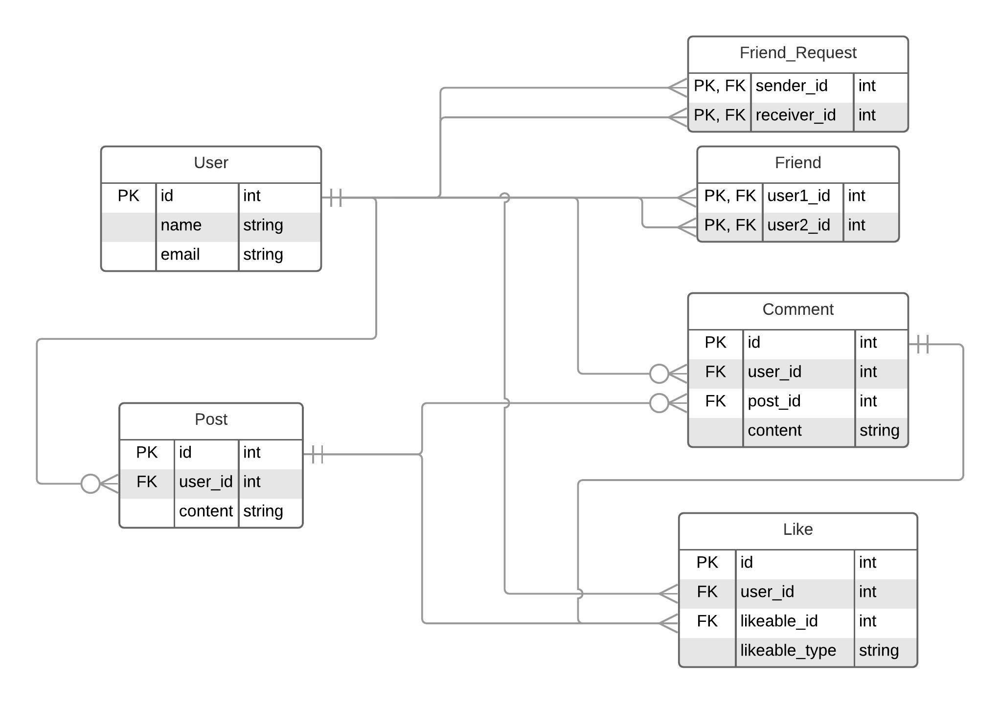

# Faceverse

This is a minmal version of facbook built in Ruby on Rails [corresponding section in Odin project](https://www.theodinproject.com/courses/ruby-on-rails/lessons/final-project)

## Getting started

clone the repo

```bash
git clone https://github.com/SunnyAsar/faceverse
```

setup postgresql (if you don't have it locally already)
```
brew install postgresql

brew services start postgresql

cd faceverse && rails db:create
```

change directory and install gems

```bash
cd faceverse && bundle install
```

Start server

```bash
rails s
```

ER Diagram





## Contributors

- [Sunny Asar](https://github.com/SunnyAsar)
- [Henry Tabima Girlado](https://github.com/HenryTabima)

