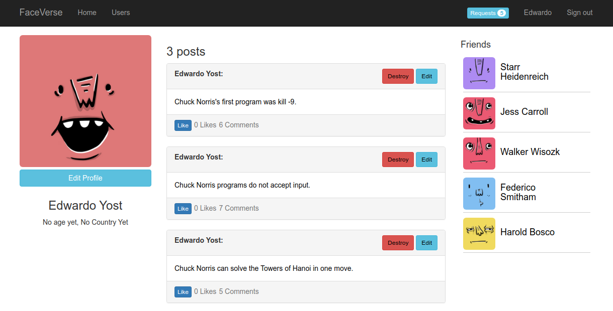
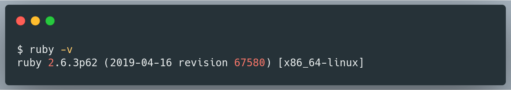
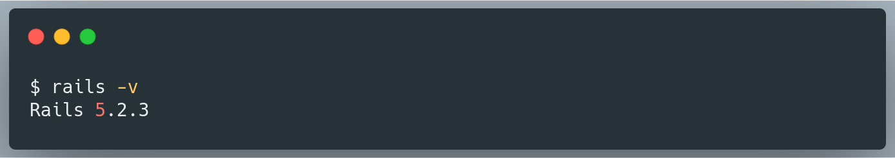
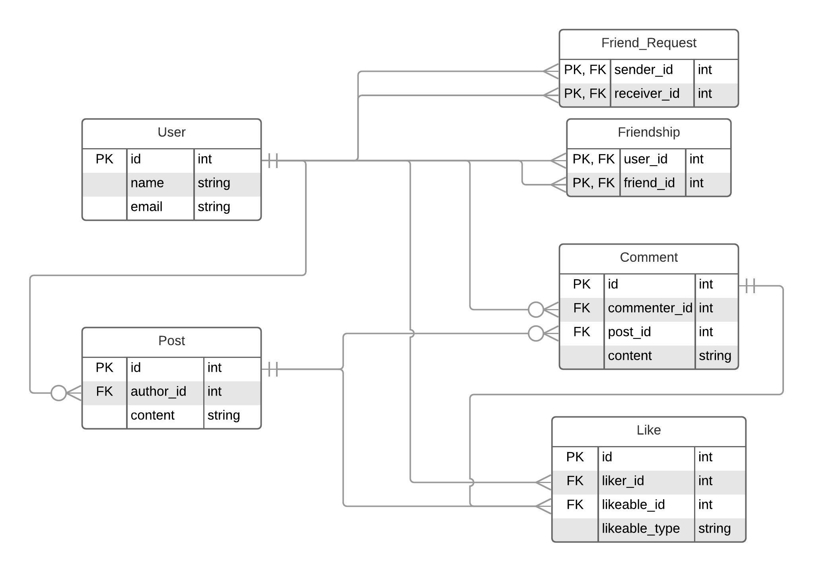

# Faceverse
This is a minimal version of facebook built in Ruby on Rails.



## Getting started

These instructions will get you a copy of the project up and running on your local machine for development and testing purposes.

### Prerequisites

This project runs on [Ruby](https://www.ruby-lang.org/en/documentation/installation/), and [Rails](http://installrails.com/)


After installation, run `ruby -v` to make sure Ruby installed correctly.
Example:



Also make sure that Rails is installed, but running `rails -v`.
Example:



### Installing

clone the repo and go to the project directory:

```bash
git clone https://github.com/SunnyAsar/faceverse
cd faceverse
```

setup database:

```bash
rails db:create
```

Install gems:

```bash
bundle install
```

Populate development data:

```bash
rails dev:populate
```

### Start development server

Run the server with the following command:

```bash
rails s
```

## Running Tests

To run the project tests, run the following command:

```bash
rspec
```

## Deploy on Heroku

You can deploy the project on [Heroku](https://www.heroku.com/) using the following steps:

1. Create a Heroku Account
2. On the terminal, run `heroku create` to create a new app
3. Run `git push heroku master` to start a deployment on Heroku.
4. Run `heroku run rail db:migrate` to run migrations on your production database.
5. Visit your project URL as assigned by Heroku to see a live deployment of Fakebook.

## Contributors

<!-- ALL-CONTRIBUTORS-LIST:START - Do not remove or modify this section -->
<!-- prettier-ignore-start -->
<!-- markdownlint-disable -->
<table>
  <tr>
    <td align="center"><a href="https://github.com/SunnyAsar"><br /><sub><b>SunnyAsar</b></sub></a><br /><a href="https://github.com/SunnyAsar/faceverse/commits?author=SunnyAsar" title="Code">💻</a> <a href="https://github.com/SunnyAsar/faceverse/commits?author=SunnyAsar" title="Documentation">📖</a></td>
    <td align="center"><a href="http://henrytabima.com"><br /><sub><b>Henry Tabima Giraldo</b></sub></a><br /><a href="https://github.com/SunnyAsar/faceverse/commits?author=HenryTabima" title="Code">💻</a> <a href="https://github.com/SunnyAsar/faceverse/commits?author=HenryTabima" title="Documentation">📖</a></td>
  </tr>
</table>

<!-- markdownlint-enable -->
<!-- prettier-ignore-end -->
<!-- ALL-CONTRIBUTORS-LIST:END -->

## License

This project is licensed under the MIT License - see the [LICENSE.md](LICENSE.md) file for details

## Acknowledgments

### Entity Relation Diagram (ERD)


